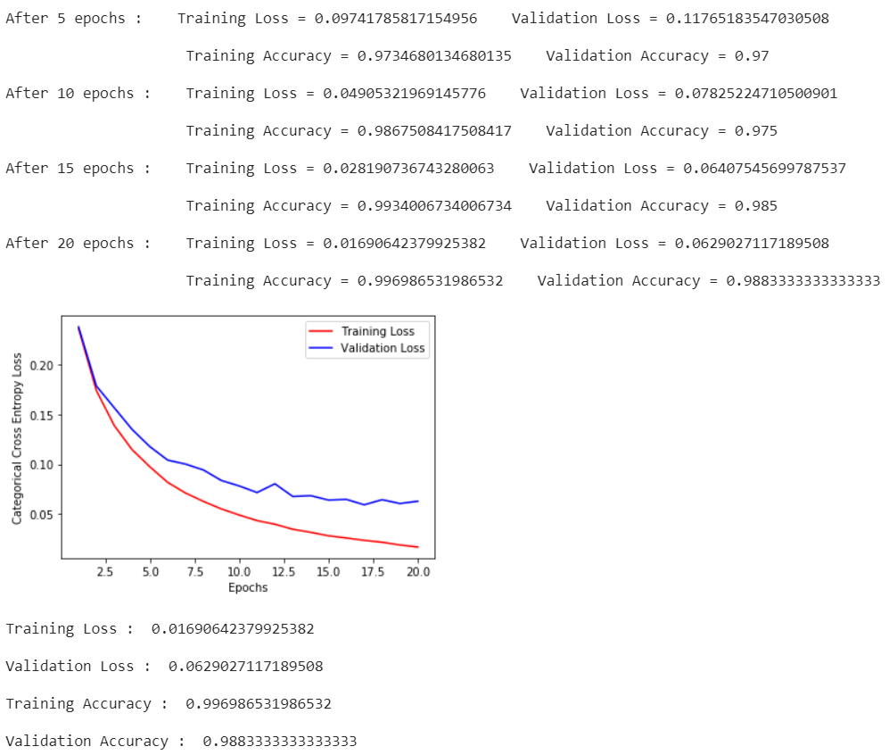
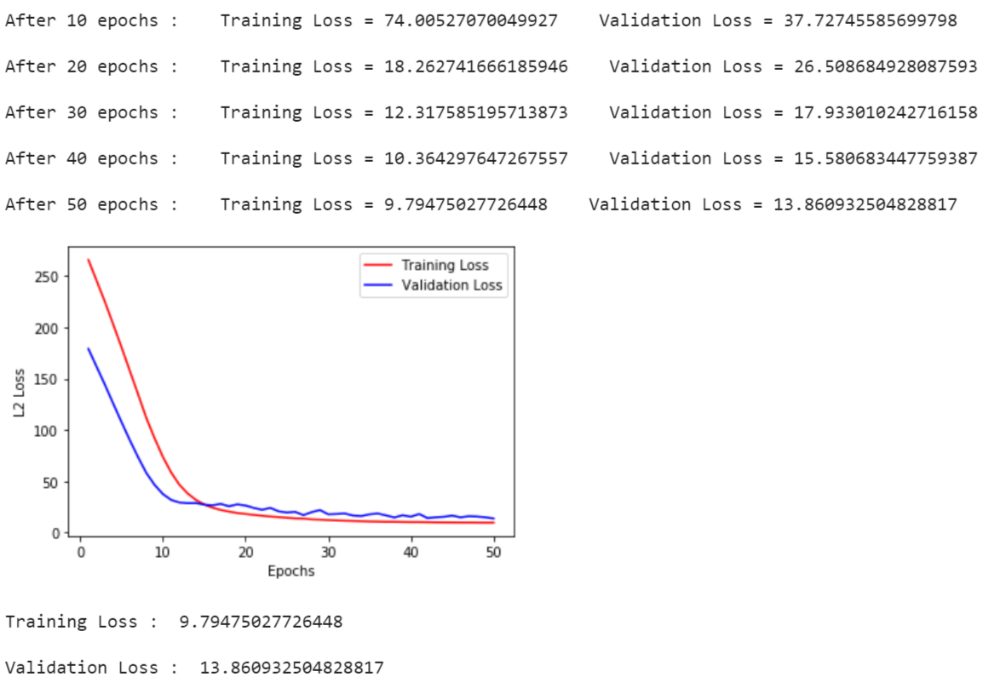

# Deep Neural Networks from Scratch using NumPy
This project implements a Python Class to define, train and evaluate Deep Neural Network models for classification and regression tasks.
It uses the Backpropagation algorithm with various Activation functions, Optimizers and Regularizers for training the model objects.
This project is completely built from scratch using the **NumPy** library. No Deep Learning framework is utilized. 
 Detailed description of this project along with results can be found [here](#project-description-and-results).

## Getting Started

### Prerequisites
Running this project on your local system requires the following packages to be installed :

* numpy
* matplotlib
    
 They can be installed from the Python Package Index using pip as follows :
 
     pip install numpy
     pip install matplotlib
     
 You can also use [Google Colab](https://colab.research.google.com/) in a Web Browser without needing to install the mentioned packages.
 
### Usage
This project is implemented as an interactive Jupyter Notebook. You just need to open the notebook on your local system or on [Google Colab](https://colab.research.google.com/) and execute the code cells in sequential order. The function of each code cell is properly explained with the help of comments. 

## Tools Used
* [NumPy](https://numpy.org/) : Used for storing and manipulating high dimensional arrays, and performing large scale mathematical computations on them.
* [Matplotlib](https://matplotlib.org/) : Used for plotting the Learning Curves.
* [Google Colab](https://colab.research.google.com/) : Used as the development environment for executing high-end computations on its backend GPUs/TPUs and for editing the Jupyter Notebook. 

## Contributing
You are welcome to contribute :

1. Fork it (https://github.com/rohanrao619/Deep_Neural_Networks_from_Scratch/fork)
2. Create new branch : `git checkout -b new_feature`
3. Commit your changes : `git commit -am 'Added new_feature'`
4. Push to the branch : `git push origin new_feature`
5. Submit a pull request !

## License
This Project is licensed under the MIT License, see the [LICENSE](LICENSE) file for details.

## Project Description and Results
### Class Methods
A Python class named **Deep_Neural_Network** is defined with the following major methods : 

* create() : The method to define the architecture of Deep Neural Network and initialize weights.

      create(self,input_size,output_size,hidden_dims,output_type,initializer='random',
             seed=None,activation='relu',leaky_relu_slope=0.1)
                 
      Parameters:

      input_size(int)       :   No. of neurons in input layer.

      output_size(int)      :   No. of classes in classification task (2 in case of binary classification,
                                modify the dataset accordingly !)
                                (or) No. of Target variables in case of regression task.

      hidden_dims(int list) :   No. of neurons in hidden layers.

      output_type(string)   :   Type of task :
                                'classification'  :  Classification (discrete target).
                                'regression'      :  Regression (continuous target).

      initializer(string)   :   Weight initializer :
                                'random'  : Random initialization.
                                'xavier'  : Xavier initialization (preferred for tanh activation).
                                'he'      : He initialization (preferred for ReLU activation).

      seed(int)             :   NumPy seed for random initialization.

      activation(string)    :   Activation function for hidden layers. One of the following :
                                'linear'  : Linear activation.
                                'sigmoid' : Sigmoid activation.
                                'tanh'    : Hyperbolic tangent activation.
                                'relu'    : Rectified Linear Unit activation.
                                'lrelu'   : Leaky Rectified Linear Unit activation.

                                Activation function at the output layer would be SoftMax for classification
                                and Linear for regression.

      leaky_relu_slope(int) :   Slope for Leaky ReLU activation.
      
* train() : The method to train the weights and biases of each layer for the provided training data with ground truths.
    
      train(self,X_train,Y_train,X_val,Y_val,optimizer='vanilla',regularizer=None,regularizer_lambda=0.02,
            keep_probs=[],mini_batch_size=32,epochs=100,learning_rate=0.01,beta=0.9,beta1=0.9,beta2=0.99,
            print_loss_freq=100,plot_loss=True)

      Parameters :

      X_train(NumPy 2D array of shape(input_size,m))   :  Input data(for batch of size m) for training.

      Y_train(NumPy 2D array of shape(output_size,m))  :  Ground truths(for batch of size m) for training.

      X_val(NumPy 2D array of shape(input_size,m))     :  Input data(for batch of size m) for validation.

      Y_val(NumPy 2D array of shape(output_size,m))    :  Ground truths(for batch of size m) for validation.

      optimizer(string)             :   Optimizer for training process, one of the following :
                                        'vanilla'     : Original gradient decsent.
                                        'momentum'    : Gradient descent with momentum.
                                        'rmsprop'     : Root mean square propagation.
                                        'adam'        : Adaptive moments estimation.

      regularizer(string)           :   Regularizer for weights of network, one of the following :
                                        'l1'      : L1 regularization.
                                        'l2'      : L2 regularization.
                                        'dropout' : Dropout regularization.
                                        None      : No regularizer.

      regularizer_lambda(float)     :   Regularization parameter lambda for L1 or L2 regularization.

      keep_probs(float[0,1] list)   :   Keeping probabilities for hidden layers in Dropout regularization.

      mini_batch_size(int)          :   Mini Batch size (1 for Stochastic gradient descent).

      epochs(int)                   :   No. of iterations over the training set.

      learning_rate(float)          :   Learning rate aplha.

      beta(float)                   :   Optimizer parameter beta for 'momentum' and 'rmsprop' optimizers.

      beta1(float)                  :   Optimizer parameter beta2 for 'adam' optimizer.

      beta2(float)                  :   Optimizer parameter beta2 for 'adam' optimizer.

      print_loss_freq(int)          :   Frequency of printing metrics.

      plot_loss(boolean)            :   Plot learning curves or not.

      Returns :

      Metrics_history(tuple)        :   History of metrics in form of lists
      
* predict() : The method to predict outputs for given unknown input data.

      predict(self,X)

      Parameters :

      X(NumPy 2D array of shape (input_size,m))  : Input data for batch of size m.

      Returns :

      Y_pred(NumPy 2D array of shape (output_size_size,m))  : Predicted output for batch of size m.
      
Other methods implemented for back-end computations are : 

* Methods computing various Activations functions and their gradients.
* forward_propagation() : The method to forward propagate input data through the network, and calculate activations of each layer in the network.
* backward_propagation() : The method to compute the gradient of cost with respect to weights and biases of each layer in the network.
* compute_cost() : The method to compute the cost for the current forward propagated batch.
* accuracy() : The method to calculate classification accuracy.
* to_one_hot() : The method to convert SoftMax probabilities to labels in one hot form.
* save_weights() : The method to save model weights.
* load_weights() : The method to load model weights.

Their detailed description can be found [here](Deep_Neural_Networks_from_Scratch_using_NumPy.ipynb).

### MNIST Handwritten Digits Classification
A Deep_Neural_Network object was created and trained with the following configuration :

    model = Deep_Neural_Network()
    
    model.create(784,10,[800],output_type='classification',activation='lrelu',initializer='he',
                 leaky_relu_slope=0.1)
                 
    costs = model.train(X_train,Y_train,X_val,Y_val,optimizer='adam',regularizer='dropout',keep_probs=[0.75],
                        mini_batch_size=128,epochs=20,print_loss_freq=5,learning_rate=0.0002)
                      
Following results were obtained : 

Test accuracy of **98.4 %** was achieved using the same model.

### Boston Housing Prices Prediction
A Deep_Neural_Network object was created and trained with the following configuration :

    model = Deep_Neural_Network()

    model.create(2,1,[10,20],output_type='regression',activation='relu',initializer='he')

    costs=model.train(X_train.T,Y_train,X_val.T,Y_val,optimizer='rmsprop',regularizer='l2',
                      regularizer_lambda=0.1,mini_batch_size=32,epochs=50,print_loss_freq=10,
                      learning_rate=0.002)
                      
Following results were obtained : 

The model produced L2 Loss of **12.64** on Test data.

## Final Notes
**Thanks for going through this Repository! Have a nice day.** 
 **Got any Queries? Feel free to contact me.** 
 **S Rohan Rao**

